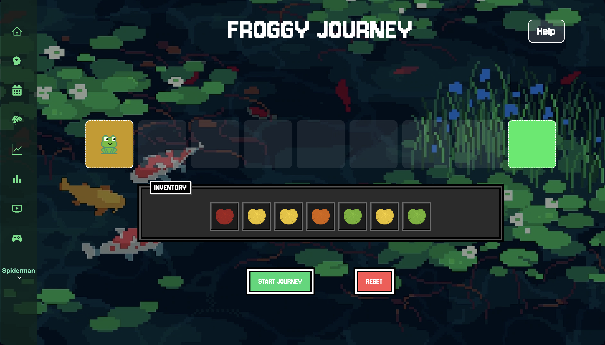

## Mindleap
Mindleap is a mental health tracking platform that combines gamification with personalized insights to support emotional well-being. It features the SCADS Test, an interactive quiz assessing five key mental health parameters:

- Stress
- Concentration
- Anxiety
- Depression
- Self-Worth
The test provides a personalized wellness report and tailored recommendations based on your current mental state.
---
## Screenshots
<table>
  <tr>
    <td></td>
    <td></td>
  </tr>
  <tr>
    <td></td>
    <td></td>
  </tr>
</table>

## Hosting status - Not Hosted

## Frontend
## Daily Wellness Visualization

- Lily Pad Indicator: Changes color (Red, Orange, Yellow, Green) based on your SCADS score to reflect your daily mental health status.
- Score Calendar: Displays lily pads across the year, highlighting mental health trends over time.

## User Profile Management

- View and update profile details (username, email, password).
- Track earned badges, total lily pads, and level progress.
- Review detailed lily pad collection by color.

## SCADS Test & Reports

- Submit a daily mental health assessment (once per day).
- Input sleep, activities, and answer introspective questions.
- Receive personalized scores, insights, and suggestions.

## Data Visualization & Analysis

- Graphical representation of your mental health patterns across categories.
- Analytical reports highlighting areas for improvement.

## Activities & Resources

- Engage with wellness activities (e.g., Yoga, Journaling, Art).
- Access external resources like music, books, and visual content.

## Score Tracking & Leaderboard

- Visualize daily scores with color-coded lily pads.
- Compete and compare with others based on level and EXP.
- Gain EXP from SCADS scores, leveling up as your mental health improves.

## Gamified Experience: Froggy’s Journey

- A mini-game simulating weekly progress, where lily pads earned influence Froggy’s crossing across a pond.
- Visualize weekly trends and motivate positive changes through interactive gameplay.
---
## Backend

## Security & Admin Features

- JWT-based authentication with bcryptjs for secure login.
- Admin panel protected by middleware to manage user accounts, view reports, and perform edits.
---
## Packages Used

<h2>Frontend Packages</h2>
<ul>
  <li>🔔 React-toastify for displaying toast notifications  </li>
  <li>🧭 React-router and react-router-dom for routing/navigation in React apps</li>
  <li>🧠 React-redux for connecting React with Redux for global state management</li>
  <li>🎨 React-icons for using popular icons</li>
  <li>📊 Recharts for visualizing charts</li>
  <li>🔗 axios for making API requests like fetching datas from backend</li>
  <li>🧰 @reduxjs/toolkit for modern way to write Redux logic with less boilerplate</li>
</ul>

<h2>Backend Packages</h2>
<ul>
  <li>🔁 Nodemon for auto restarting server on changes</li>
  <li>🍃 Mongoose for ODM (Object Data Modeling) library for MongoDB</li>
  <li>🔐 Jsonwebtoken for creating and verifying jwt for authentication and authorization</li>
  <li>⚙️ Express-async-handler for simplifying error handling in async/await route handlers</li>
  <li>🌍 Express for framework for building web servers and APIs in Node.js.</li>
  <li>🔐 Dotenv for loading environment variables from .env files</li>
  <li>🔄 Cors for enabling Cross-Origin Resource Sharing for communication between frontend and backend</li>
  <li>🍪 Cookie-parser for parsing Cookie header and populates req.cookies with an object</li>
  <li>🚀 Concurently for running multiple commands/scripts in parallel like frontend and backend</li>
  <li>🔐 Bcryptjs for password hashing</li>
</ul>

---

## 🖥️ Localhost Setup
Follow these steps to run the project locally:

## 1️⃣ Clone the Repository
<pre>
git clone https://github.com/AadidevSoni/Gamified-Mental-Health-Tracker.git
cd &lt;your-repo-name&gt;
</pre>

---
## Grow Your Wellbeing

Mindleap encourages daily reflection and mindful growth—one lily pad at a time.
---
